# Modelo entidad-relación

Diagrama de relaciones del SGE. Las columnas transversales (`id` UUID,
`createdAt`, `updatedAt` y `active`/borrado lógico por dominio) se omiten del
diagrama por claridad; ver el [diccionario de datos](diccionario-datos.md) para el
detalle de columnas y las convenciones **Prisma del estándar PTNV**.

> Nota: `Kardex` es una **vista calculada**, no una tabla persistente. Se
> representa punteada porque no tiene migración propia.

## 1. Diagrama (Mermaid)

```mermaid
erDiagram
    ROLES ||--o{ ROLE_PERMISSIONS : "tiene"
    PERMISSIONS ||--o{ ROLE_PERMISSIONS : "concede"
    USERS ||--o{ AUDIT_LOGS : "genera"
    USERS |o--o| STUDENTS : "puede ser"
    USERS |o--o| TEACHERS : "puede ser"

    STUDENTS ||--o{ GUARDIANS : "tiene"
    STUDENTS ||--o{ STUDENT_MOVEMENTS : "registra"
    STUDENTS ||--o{ DOCUMENTS : "posee"
    STUDENTS ||--o{ ENROLLMENTS : "cursa"
    STUDENTS ||--o{ CHARGES : "adeuda"
    STUDENTS ||--o{ EXAM_ATTEMPTS : "presenta"
    STUDENTS ||--o{ ATTENDANCE : "asiste"

    TEACHERS ||--o{ GROUPS : "imparte"
    COURSES ||--o{ GROUPS : "se abre en"
    TERMS ||--o{ GROUPS : "agrupa"
    GROUPS ||--o{ ENROLLMENTS : "contiene"
    GROUPS ||--o{ ASSESSMENTS : "evalúa"
    GROUPS ||--o{ ONLINE_EXAMS : "aplica"
    GROUPS ||--o{ ATTENDANCE_SESSIONS : "registra"

    ENROLLMENTS ||--o{ GRADES : "recibe"
    ASSESSMENTS ||--o{ GRADES : "califica"

    COURSES ||--o{ QUESTIONS : "agrupa"
    QUESTIONS ||--o{ QUESTION_OPTIONS : "ofrece"
    QUESTIONS ||--o{ ONLINE_EXAM_QUESTIONS : "incluye"
    ONLINE_EXAMS ||--o{ ONLINE_EXAM_QUESTIONS : "contiene"
    ONLINE_EXAMS ||--o{ EXAM_ATTEMPTS : "genera"
    EXAM_ATTEMPTS ||--o{ ATTEMPT_ANSWERS : "responde"
    QUESTIONS ||--o{ ATTEMPT_ANSWERS : "responde"

    FEE_CONCEPTS ||--o{ CHARGES : "origina"
    TERMS ||--o{ CHARGES : "periodo"
    CHARGES ||--o{ PAYMENTS : "cobra"

    ATTENDANCE_SESSIONS ||--o{ ATTENDANCE : "detalla"
    ATTENDANCE ||--o{ JUSTIFICATIONS : "justifica"

    NOTIFICATION_TEMPLATES ||--o{ NOTIFICATIONS : "usa"

    USERS ||--o{ USER_ROLES : "tiene"
    ROLES ||--o{ USER_ROLES : "asigna"
    USERS ||--o{ USER_PERMISSIONS : "excepción"
    POLICIES ||--o{ POLICY_CONDITIONS : "evalúa"
    LEVELS ||--o{ COURSES : "clasifica"
    DOCUMENT_TYPES ||--o{ DOCUMENTS : "tipifica"
    PROGRAMS ||--o{ PROGRAM_SUBJECTS : "plan de estudios"
    COURSES ||--o{ PROGRAM_SUBJECTS : "materia"
    PROGRAMS ||--o{ STUDENT_PLANS : "se asigna"
    STUDENTS ||--o{ STUDENT_PLANS : "contrata"
    STUDENT_PLANS ||--o{ CHARGES : "genera"
    MIGRATION_BATCHES ||--o{ MIGRATION_ROWS : "registra"
```

## 2. Agrupación por módulo

| Módulo | Entidades |
|---|---|
| M02 | `users`, `roles`, `permissions`, `role_permissions`, `user_roles`, `user_permissions`, `policies`, `policy_conditions`, `policy_roles`, `refresh_tokens`, `password_reset_tokens`, `audit_logs` |
| M11 | `settings`, `levels`, `terms`, `cancellation_reasons`, `document_types` |
| M03 | `students`, `guardians`, `student_number_sequences` |
| M04 | `teachers` |
| M05 | `student_movements` |
| M06 | `documents`; `kardex` es una vista calculada |
| M07 | `courses`, `groups`, `enrollments` |
| M08 | `assessments`, `grades` |
| M09 | `fee_concepts`, `charges`, `payments`, `receipt_sequences`, `idempotency_records` |
| M14 | `questions`, `question_options` |
| M15 | `online_exams`, `online_exam_questions` |
| M16/M17 | `exam_attempts`, `attempt_answers` |
| M18 | `attendance_sessions`, `attendance`, `justifications` |
| M19 | `notification_templates`, `notifications`, `notification_preferences` |
| M20 | `migration_batches`, `migration_rows` |
| M22 | `programs`, `program_subjects`, `student_plans` (y `charges.plan_id`) |

## 3. Notas de integridad

- **Unicidad:** `users.username`, `users.email`, `students.studentNumber`,
  `students.curp`, `teachers.email`, `payments.receiptNumber`, `roles.key`,
  `permissions.key`.
- **Claves foráneas:** sin `DELETE` físico de datos de negocio; el estándar usa
  `active` y borrado lógico **por dominio** (`deletedAt`, `cancelledAt`,
  `voidedAt`). Las relaciones usan `onDelete: Restrict` salvo cascadas explícitas
  en tablas puente/dependientes (ver [D-003](../../DECISIONES.md)).
- **Índices recomendados:**
  - `students(studentNumber)`, `students(curp)`, `students(status)`;
  - `enrollments(studentId, groupId)` único parcial (estatus activo);
  - `charges(studentId, status)`;
  - `attendance(sessionId, enrollmentId)` único;
  - `audit_logs(entityType, entityId)`, `audit_logs(userId, createdAt)`.
- **Enums** en `UPPER_SNAKE` (Prisma); dinero/medidas con `Decimal @db.Decimal(...)`.
- **Borrado lógico por dominio:** cuando un registro se desactiva/recicla, el
  índice único parcial se define en migración SQL (Prisma no lo modela).
